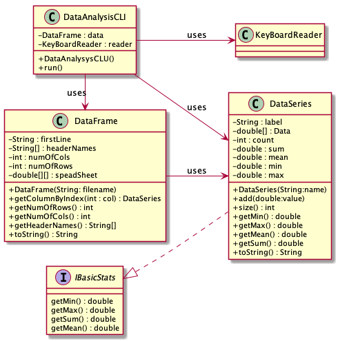
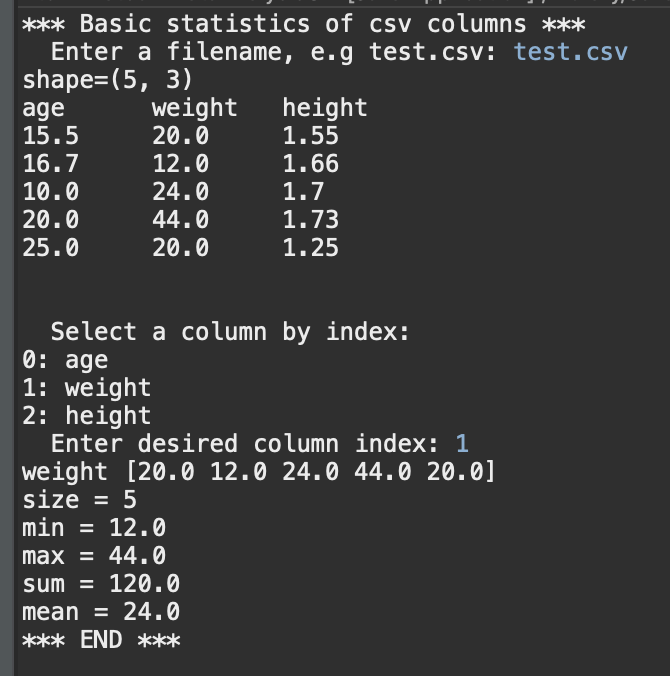
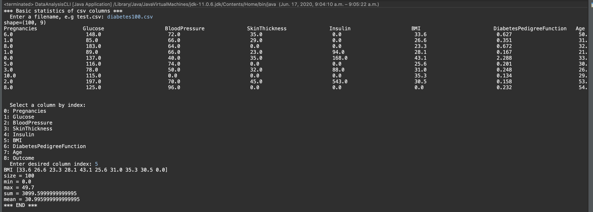

# Data Analysis report
Author: Thien Nguyen

## UML class diagram
```
@startuml
left to right direction
skinparam classAttributeIconSize 0

interface IBasicStats{
getMin() : double
getMax() : double
getSum() : double
getMean() : double
}

class DataSeries{
-String : label
-double[] : Data
-int : count
-double : sum
-double : mean
-double : min
-double : max
+DataSeries(String:name)
+add(double:value)
+size() : int
+getMin() : double
+getMax() : double
+getMean() : double
+getSum() : double
+toString() : String
}

class DataFrame{
-String : firstLine
-String[] : headerNames
-int : numOfCols
-int : numOfRows
-double[][] : speadSheet
+DataFrame(String: filename)
+getColumnByIndex(int : col) : DataSeries
+getNumOfRows() : int
+getNumOfCols() : int
+getHeaderNames() : String[]
+toString() : String
}

class DataAnalysisCLI{
-DataFrame : data
-KeyBoardReader : reader
+DataAnalysysCLU()
+run()
}

class KeyBoardReader{
}

class DataSeries implements IBasicStats
DataAnalysisCLI --> KeyBoardReader : uses
DataAnalysisCLI -> DataFrame : uses
DataAnalysisCLI --> DataSeries : uses
DataFrame --> DataSeries : uses
@enduml
```

## Execution and Testing

###Test.csv execution

###Diabetes100.csv execution
