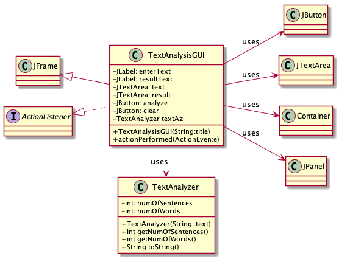
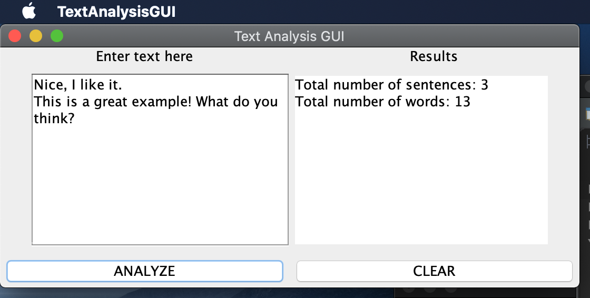
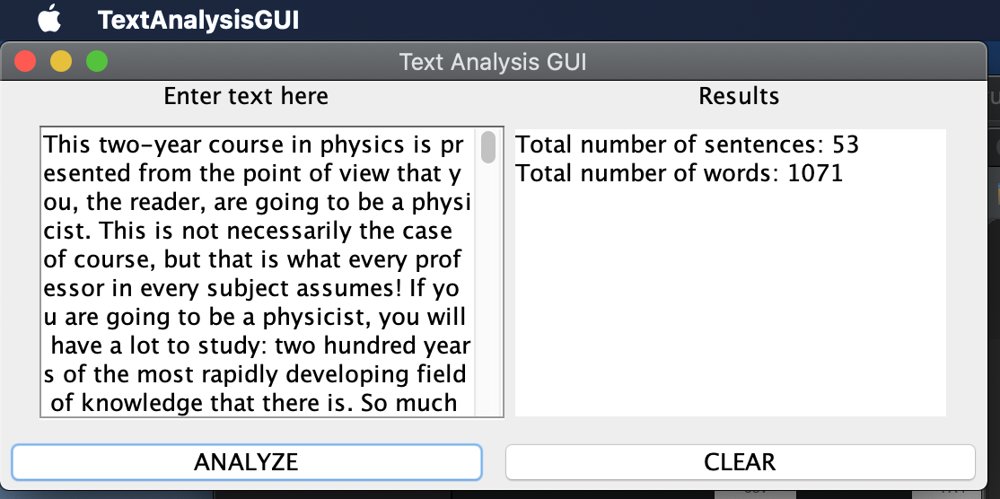

# Text Analysis report
Author: Thien Nguyen

## UML class diagram
```
@startuml
left to right direction
skinparam classAttributeIconSize 0

class JFrame

class TextAnalysisGUI{
-JLabel: enterText
-JLabel: resultText
-JTextArea: text
-JTextArea: result
-JButton: analyze
-JButton: clear
-TextAnalyzer textAz
+TextAnalysisGUI(String:title)
+actionPerformed(ActionEven:e)
}

class TextAnalyzer{
-int: numOfSentences
-int: numOfWords
+TextAnalyzer(String: text)
+int getNumOfSentences()
+int getNumOfWords()
+String toString()
}

interface ActionListener

class JButton

class JTextArea

class Container

class TextAnalysisGUI extends JFrame
class TextAnalysisGUI implements ActionListener
TextAnalysisGUI -> TextAnalyzer : uses
TextAnalysisGUI --> JTextArea : uses
TextAnalysisGUI --> Container : uses
TextAnalysisGUI --> JPanel : uses
TextAnalysisGUI --> JButton : uses
@enduml
```

## Execution and Testing

